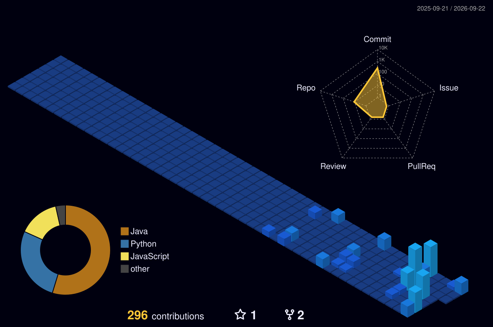

 

 

---

## 👩‍💻 About Me

**Hi, I'm Poojaa D V 👋**

- 📍 **Location:** India 🇮🇳
- 🎓 **Education:** B.E. Computer Science and Engineering
- 💼 **Roles:** Aspiring Software Developer · Full-Stack Architect · Data Engineer

**Current focus**

- 🚀 Building production-ready software
- 🌐 Developing scalable full-stack applications
- 📊 Designing reliable data systems
- 🤖 Exploring AI-powered software workflows
- 🌱 Continuously learning modern technologies
- 👯 Open to internships and collaborations

---

## 🖥️ Terminal Intro

  

---

## 🛠️ Tech Stack & Tools

---

## 🔥 GitHub Streak

  

---

## 👾 Pac-Man Contribution Graph

  <picture>
    <source media="(prefers-color-scheme: dark)" srcset="https://raw.githubusercontent.com/poojaaxx/poojaaxx/output/pacman-contribution-graph-dark.svg" />
    <source media="(prefers-color-scheme: light)" srcset="https://raw.githubusercontent.com/poojaaxx/poojaaxx/output/pacman-contribution-graph.svg" />
    
  </picture>

---

## 🐍 Contribution Snake

  <picture>
    <source media="(prefers-color-scheme: dark)" srcset="https://raw.githubusercontent.com/poojaaxx/poojaaxx/output/github-snake-dark.svg" />
    <source media="(prefers-color-scheme: light)" srcset="https://raw.githubusercontent.com/poojaaxx/poojaaxx/output/github-snake.svg" />
    
  </picture>

---

## 📊 GitHub Statistics

  

---

## 💻 Most Used Languages

  

---

## ⚡ Recent GitHub Activity

<!--START_SECTION:activity-->
- `2026-09-20` 🔨 Pushed commits to `main` in [poojaaxx/poojaaxx](https://github.com/poojaaxx/poojaaxx)
- `2026-09-19` 🔨 Pushed commits to `feature/initial-build` in [poojaaxx/banking-system](https://github.com/poojaaxx/banking-system)
- `2026-09-19` 🔨 Pushed commits to `main` in [poojaaxx/banking-system](https://github.com/poojaaxx/banking-system)
- `2026-09-13` 🔨 Pushed commits to `master` in [poojaaxx/caseworker-morning-agent](https://github.com/poojaaxx/caseworker-morning-agent)
- `2026-09-09` 🔨 Pushed commits to `main` in [poojaaxx/gridcast](https://github.com/poojaaxx/gridcast)
- `2026-09-09` ⭐ Starred [poojaaxx/recoverai](https://github.com/poojaaxx/recoverai)
- `2026-08-28` 🔨 Pushed commits to `main` in [poojaaxx/recoverai](https://github.com/poojaaxx/recoverai)
- `2026-08-27` 🔨 Pushed commits to `main` in [poojaaxx/recoverai](https://github.com/poojaaxx/recoverai)
<!--END_SECTION:activity-->

---

## 🌌 3D Contribution Calendar

  

---

## 🎯 Mission

> Build reliable software, design scalable full-stack and data systems, explore emerging technologies, contribute to meaningful projects, and continuously grow as a software engineer.

---

## 💬 Random Developer Quote

  

---

## ⚡ Open to Internships, Collaborations & Open Source

I'm actively looking for internship opportunities and happy to collaborate on meaningful projects and open source.

  
  

